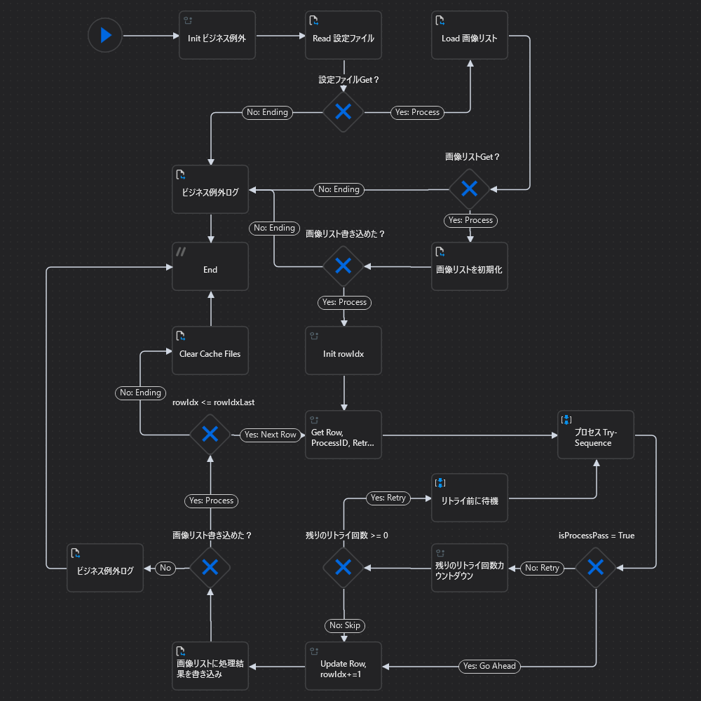

# UiPath-SimpleOCR

## 機能／概要
* 画像ファイルから、日時の文字列をOCRで抽出する。

## 流れ

1. 設定ファイルを読み込む。

1. 画像リストファイルを読み込む。

1. 画像ファイルを読み込み、座標を指定して日時の部分を切り抜く。

1. OCRしやすい画像に変換する。

1. 日時の文字列を、OCRで抽出する。

1. 画像キャッシュファイルを削除する。

1. OCRで抽出した文字列を、スプレッドシートに保存する。

1. 終了前にも、画像キャッシュファイルを削除する。

メインフローチャート図

## 対応しているビジネス例外
* 設定ファイルが読み込めない時
* 必須設定項目がない時 in Name列
* 必須設定項目が空欄の時 in Value列
* OCR対象画像ファイルリストが読み込めない時
* OCR対象画像ファイルリストが書き込めない時
* OCR対象画像ファイルリストにデータ行がない時

## 構成
* Config.xlsx
    * 設定ファイル。

* image-list.xlsx
    * OCR対象画像ファイルリスト。
    * 項目ヘッダー
        * path
            * OCR対象画像ファイルパス。処理実行前に記入しておく必須項目。
        * ocr-result
            * OCR結果　または　例外メッセージ　が書き込まれる項目。
        * timestamp
            * 処理実行時のタイムスタンプ　が書き込まれる項目。
        * process-id
            * 処理実行時のプロセスID　が書き込まれる項目。
    * path以外の項目が記入されていた場合、処理実行時にUiPathによって上書きされる。

* MainChart
    * メインフローチャート。
    * 設定したリトライ回数内で、Processを実行する。
    * リトライ回数内で例外が解決しなかった場合
        * スプレッドシートに例外メッセージを書き込む。
    * ビジネス例外が発生した場合
        * ビジネス例外をログに出力する。
        * 処理を終了する。

* Parts  
    * ImageTrim  
        * 画像ファイルから、指定した座標と大きさの部分を切り抜く。

    * ImageChar  
        * OCRしやすい画像に変換する。
        * OpenCV(Pythonライブラリ)使用。

    * ImageOCR  
        * 日時の文字列を、OCRで抽出する。
        * Tesseract(UiPathアクティビティ)使用。

    * Process
        * 画像を切り抜く→文字画像を作成→OCRする→OCR結果をログ出力→画像キャッシュファイル削除をまとめたシーケンス。

    * ImageListInit
        * OCR対象画像ファイルリストを初期化する。

    * ClearCacheFiles  
        * 画像キャッシュファイルを削除する。
        * 実行のタイミングによっては、UiPathプロジェクト外のシステムによるファイルロックなどで、削除できない場合がある。その場合は、ログを出力する。

* Util
    * LoadList  
        * 画像リストファイルを読み込む。

    * ProcessLog
        * プロセスID＆ラベル＆メッセージで構成されるログを出力する。

    * ReadConfig  
        * 設定ファイルを読み込む。

    * WriteList  
        * 画像リストファイルを書き込む。

* Scripts
    * get_char_img.py
        * OCRしやすい画像に変換するために、UiPathからInvokeされるPythonスクリプト。指定したRGBカラー範囲内の画素を黒色にする。範囲外の画素を白色にする。

* TEST
    * いくつかのPartsをテストするシーケンスを格納。

* Data
    * test-image
        * テスト画像を格納。
    * ImgTrim
        * 設定ファイルの初期値にて、切り抜き画像キャッシュファイルの保存先フォルダとして設定されているフォルダ。
    * ImgChar
        * 設定ファイルの初期値にて、文字画像キャッシュファイルの保存先フォルダとして設定されているフォルダ。

## 動作環境
* Windows OS 10 64bit
* UiPath Studio v2024.10.4
  * UiPath.Python.Activities v1.8.1
* Python v3.12
  * opencv-python v4.10.0
* .NET 6.0 Desktop Runtime v6.0.33

